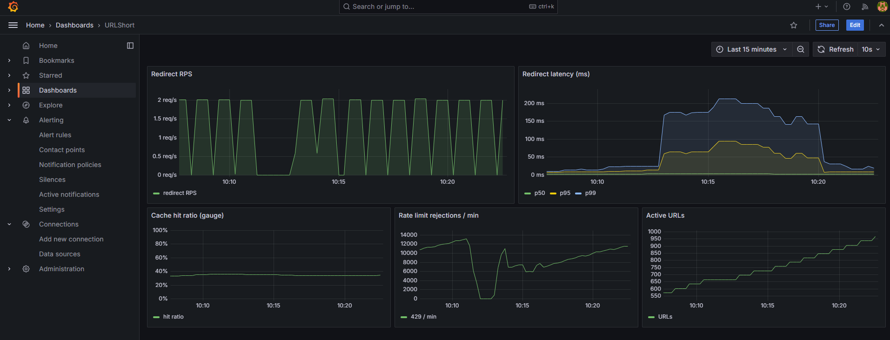
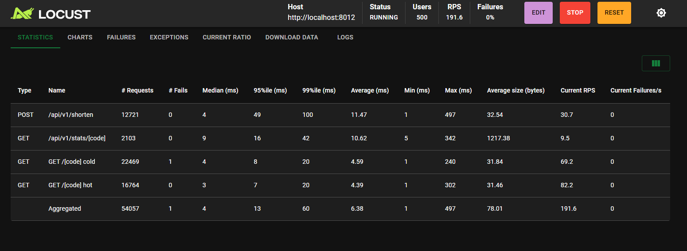
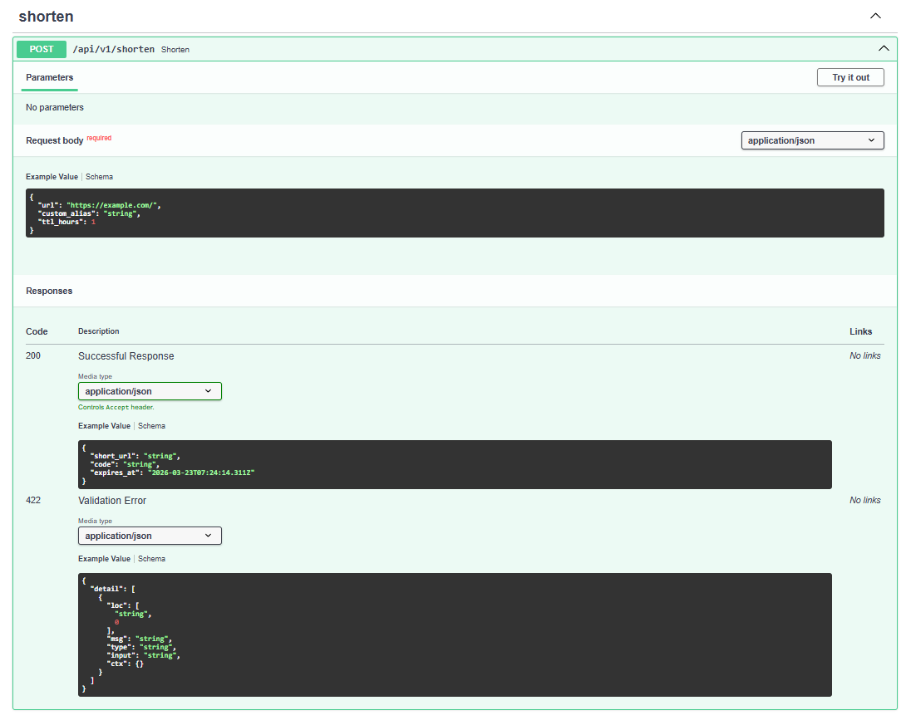
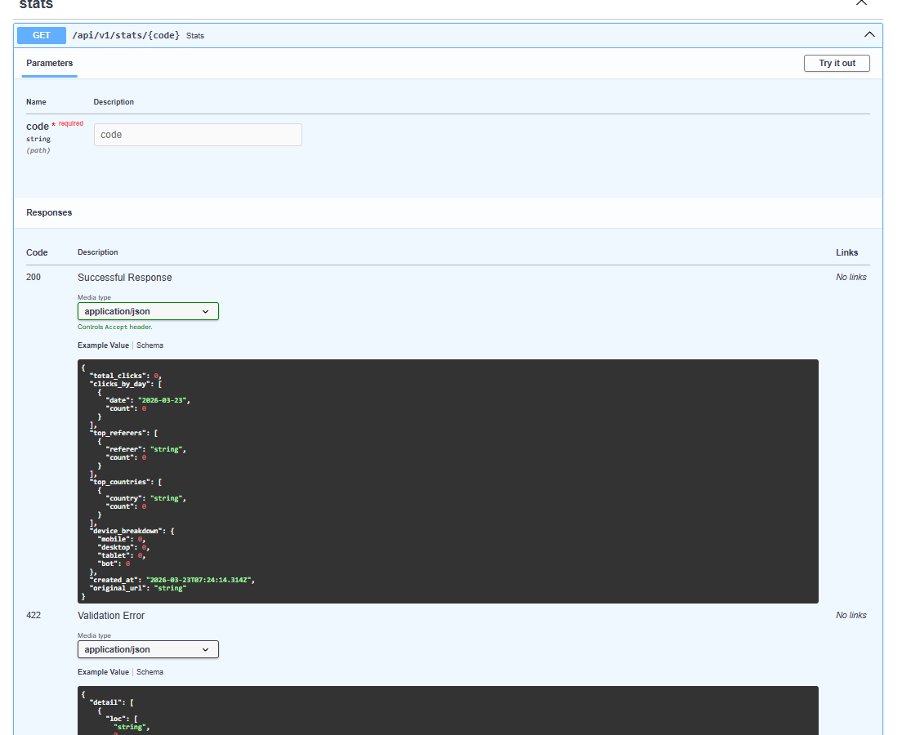
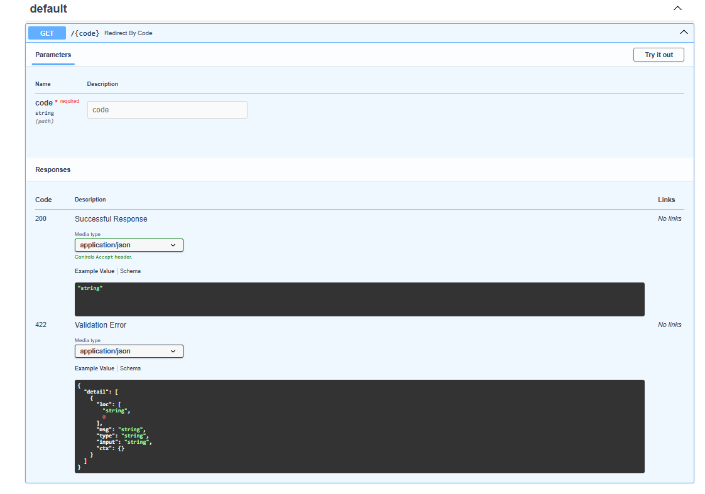

# URLShort

[](https://github.com/sayomiyori/URLShort/actions/workflows/ci.yml)
[](#)
[](#)
[](#)
[](#)
[](#)
[](#)
[](#)

High-performance URL shortener built with **FastAPI + PostgreSQL + Redis** — GeoIP analytics, Nginx microcaching, Prometheus metrics, Grafana dashboard, and Locust load testing.

## Architecture

```
┌──────────┐     ┌──────────────────┐     ┌──────────────────┐     ┌────────────┐
│ Client   │────▶│ Nginx            │────▶│ FastAPI          │────▶│ PostgreSQL │
└──────────┘     │ microcache 301s  │     │ /shorten (POST)  │     │ urls       │
                 │ rate limit L1    │     │ /{code}  (GET)   │     │ clicks     │
                 └──────────────────┘     │ /stats   (GET)   │     └────────────┘
                                          └────────┬─────────┘
                                                   │
                                          ┌────────▼─────────┐
                                          │ Redis            │
                                          │ url:{code}  LRU  │
                                          │ clicks:{code} +1 │
                                          │ rl:*    ZSET     │
                                          └──────────────────┘
```

## Screenshots

### Grafana Dashboard


### Locust Load Test (500 concurrent users)


### Swagger UI




## Performance

Tested with Locust — 500 concurrent users, 4 scenarios (create / redirect hot / redirect cold / stats):

| Metric            | Value       |
|-------------------|-------------|
| RPS (aggregated)  | ~180 req/s  |
| Latency p50       | 4 ms        |
| Latency p95       | 14 ms       |
| Latency p99       | 65 ms       |
| Failures          | 0%          |
| Concurrent users  | 500         |

> Single FastAPI instance in Docker on a local machine. Nginx microcaching disabled for benchmarking purity.

## Tech Stack

| Component | Technology |
|-----------|-----------|
| API | FastAPI (asyncio) |
| Database | PostgreSQL 16, SQLAlchemy 2 (asyncpg) |
| Cache / Rate-limit / Counters | Redis 7 (ZSET sliding window, INCR + Lua flush) |
| GeoIP | MaxMind GeoLite2-City (optional) |
| User-Agent parsing | `user-agents` |
| Reverse proxy | Nginx 1.27 (microcaching 301 redirects, 10m) |
| Metrics | Prometheus + Grafana |
| Load testing | Locust |

## Architecture Decisions

**Redis sliding window (ZSET) over token bucket** — ZSET gives exact per-second precision and survives Redis restart. Token bucket leaks state and requires periodic refill logic.

**Atomic counters + periodic flush over direct DB writes** — `INCR` is O(1) and non-blocking. Flushing every 60s reduces PostgreSQL write load by ~100x under heavy traffic. Counter state is durable in Redis between flushes.

**Nginx microcaching for 301 redirects** — hot URLs are served from Nginx memory without hitting FastAPI at all. `X-Cache-Status` header for debugging. Cache TTL 10 minutes balances freshness vs performance.

**Base62 over UUID** — shorter codes (6 chars vs 36), URL-safe, human-readable. Sequential IDs prevent collisions without retry logic.

## Quick Start

```bash
# API + dependencies only
docker compose up -d postgres redis app

# Full stack (+ Nginx :8080, Prometheus :9090, Grafana :3000)
docker compose up -d
```

> **GeoLite2** — pass `MAXMIND_LICENSE_KEY` at build time:
> ```bash
> MAXMIND_LICENSE_KEY=your_key docker compose build app
> docker compose up -d
> ```
> Without the key, the app works without geolocation (`country`/`city` = null).

**Grafana**: `http://localhost:3000` — login `admin` / password `admin`. The **URLShort** dashboard is auto-provisioned.

## API

### `POST /api/v1/shorten`

Create a short URL.

```json
// Request
{
  "url": "https://example.com/very/long/path",
  "custom_alias": "my-link",   // optional, 3–20 chars [a-zA-Z0-9_-]
  "ttl_hours": 24               // optional, TTL in hours
}

// Response 200
{
  "short_url": "http://localhost:8012/my-link",
  "code": "my-link",
  "expires_at": "2025-03-22T12:00:00+00:00"
}
```

| Status | Reason |
|--------|--------|
| 200 | Created |
| 409 | `custom_alias` already taken |
| 422 | Invalid alias or URL |

### `GET /{code}`

Redirect to original URL (301). Click is recorded asynchronously.

| Status | Reason |
|--------|--------|
| 301 | Redirect |
| 404 | Code not found or expired |
| 429 | Rate limit exceeded (`Retry-After` header) |

### `GET /api/v1/stats/{code}`

Click statistics for the last 30 days.

```json
{
  "total_clicks": 1500,
  "original_url": "https://example.com/very/long/path",
  "created_at": "2025-03-01T10:00:00+00:00",
  "clicks_by_day": [
    {"date": "2025-03-01", "count": 42}
  ],
  "top_referers": [
    {"referer": "https://google.com", "count": 800}
  ],
  "top_countries": [
    {"country": "US", "count": 600}
  ],
  "device_breakdown": {
    "desktop": 900,
    "mobile": 500,
    "tablet": 80,
    "bot": 20
  }
}
```

### `GET /metrics`

Prometheus metrics (text/plain).

## Prometheus Metrics

| Metric | Type | Description |
|--------|------|-------------|
| `redirects_total` | Counter | Redirects; labels: `status_code`, `cached` |
| `short_url_created_total` | Counter | Successful URL creations |
| `redirect_duration_seconds` | Histogram | `GET /{code}` latency (buckets up to 250 ms) |
| `cache_operations_total` | Counter | Redis URL cache; label: `result` = `hit`/`miss` |
| `cache_hit_ratio` | Gauge | hit/(hit+miss), updated every 10s |
| `rate_limit_rejected_total` | Counter | 429 responses from rate limiter |
| `active_urls_total` | Gauge | Active URLs in DB, updated every 10s |

## Redis Architecture

| Key | Type | Purpose |
|-----|------|---------|
| `url:{code}` | String (JSON) | URL record cache, TTL 1h |
| `clicks:{code}` | String (int) | Atomic click counter; flushed to PG every 60s |
| `rl:redirect:{ip}` | ZSET | Sliding-window rate limit for redirects (100 req/min) |
| `rl:shorten:{key/ip}` | ZSET | Sliding-window rate limit for URL creation (30 req/min) |

## Running Tests

```bash
# Start PostgreSQL and Redis
docker compose up -d postgres redis

# Install dev dependencies
pip install -e ".[dev]"

# Run tests
pytest -v
```

## Load Testing (Locust)

```bash
# Start full stack
docker compose up -d postgres redis app prometheus grafana

# Start Locust
locust -f locustfile.py --host=http://localhost:8012 --users=500 --spawn-rate=50
```

Locust web UI: `http://localhost:8089`

### Scenarios

| Task | Request | Weight |
|------|---------|--------|
| CreateURL | `POST /api/v1/shorten` | 1 |
| RedirectHot | `GET /{code}` — hot codes (up to 10 per user) | 8 |
| RedirectCold | `GET /{code}` — random or non-existent code | 2 |
| GetStats | `GET /api/v1/stats/{code}` | 1 |

## License

GeoLite2 database **GeoLite2-City.mmdb** is distributed by MaxMind under a [separate license](https://www.maxmind.com/en/geolite2/eula). Pass `MAXMIND_LICENSE_KEY` at Docker build time or mount the file via `MAXMIND_CITY_DB_PATH`.