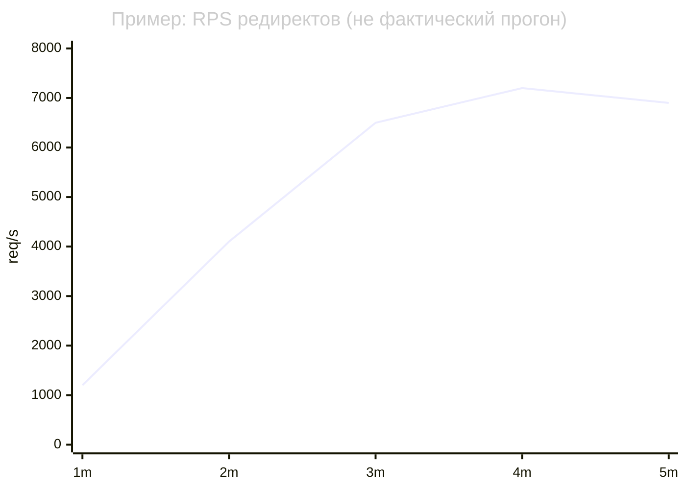
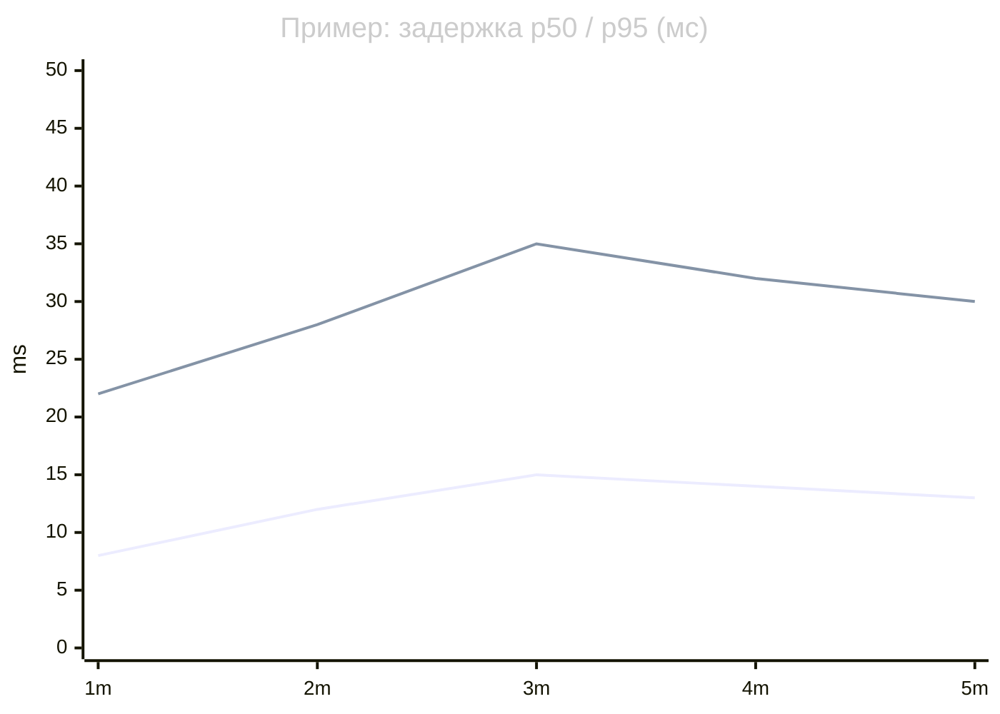

# URLShort

Высоконагруженный сокращатель ссылок на **FastAPI**, **PostgreSQL**, **Redis**, **Nginx**, метриками **Prometheus** и дашбордом **Grafana**.

## Быстрый старт (Docker)

```bash
docker compose up -d postgres redis app
# опционально: MAXMIND_LICENSE_KEY для GeoLite2 при сборке app
```

Приложение: `http://localhost:8000`  
Стек observability: `docker compose up -d` (включает **Prometheus** `:9090`, **Grafana** `:3000`, опционально **Nginx** `:8080`).

- Grafana: логин `admin` / пароль `admin`  
- Дашборд **URLShort** подключается автоматически (provisioning).

## Метрики Prometheus

Эндпоинт: `GET /metrics` (также используется [starlette-prometheus](https://github.com/stephenhillier/starlette-prometheus) для HTTP-метрик).

Кастомные серии (имена как в Grafana):

| Метрика | Тип | Описание |
|--------|-----|----------|
| `redirects_total` | Counter | `status_code`, `cached` (`true`/`false`) |
| `short_url_created_total` | Counter | Успешные создания коротких ссылок |
| `redirect_duration_seconds` | Histogram | Время обработки редиректа (бакеты до 250 ms) |
| `cache_operations_total` | Counter | `result` = `hit` / `miss` |
| `cache_hit_ratio` | Gauge | Обновляется ~каждые 10 с |
| `rate_limit_rejected_total` | Counter | Ответы 429 от лимитера |
| `active_urls_total` | Gauge | Число активных URL в БД |

## Чеклист: Locust, Prometheus, Grafana

| Пункт | Статус | Где в репозитории |
|--------|--------|-------------------|
| **Locust-сценарии** | готово | [`locustfile.py`](locustfile.py) — веса 1 / 8 / 2 / 1 |
| **Prometheus-метрики** | готово | [`app/metrics.py`](app/metrics.py), `GET /metrics`, [`prometheus/prometheus.yml`](prometheus/prometheus.yml) |
| **Grafana дашборд** | готово | [`grafana/dashboards/urlshort.json`](grafana/dashboards/urlshort.json), provisioning в [`grafana/provisioning/`](grafana/provisioning/) |
| **Результаты в README с графиками** | таблица + шаблоны ниже; числа и PNG — после вашего прогона | раздел [Performance и графики](#performance-и-графики) |

Цепочка нагрузки: **Locust** → HTTP → **app** → **GET /metrics** → **Prometheus** (scrape) → **Grafana** (дашборд **URLShort**, `uid=urlshort`).

## Нагрузочное тестирование (Locust)

Установка (dev-зависимости):

```bash
pip install -e ".[dev]"
```

Поднимите стек (хотя бы `app`, `postgres`, `redis`; для метрик в Grafana — ещё `prometheus` и `grafana`):

```bash
docker compose up -d postgres redis app prometheus grafana
```

Запуск Locust (хост и порт как у вашего API):

```bash
locust -f locustfile.py --host=http://localhost:8000 --users=500 --spawn-rate=50
```

Веб-UI Locust: `http://localhost:8089` (параметры можно задать и там).

### Сценарии (`locustfile.py`)

| Сценарий | Запрос | Вес |
|----------|--------|-----|
| **CreateURL** | `POST /api/v1/shorten` со случайным URL | 1 |
| **RedirectHot** | `GET /{code}` — код из пула до 10 «горячих» на пользователя | 8 |
| **RedirectCold** | `GET /{code}` — случайный известный код или случайная строка | 2 |
| **GetStats** | `GET /api/v1/stats/{code}` | 1 |

## Performance и графики

### Таблица результатов (заполните после прогона)

Снимите значения из **Grafana** (панели дашборда) или **Prometheus** (Explore), после стабилизации нагрузки.

| Metric | Value |
|--------|-------|
| RPS (redirect) | _замените_ |
| Latency p50 | _замените_ ms |
| Latency p95 | _замените_ ms |
| Latency p99 | _замените_ ms |
| Cache hit ratio | _замените_ % |

### Примерные кривые (Mermaid)

Ниже — **иллюстрация формата** отчёта; подставьте свои числа или замените блоки скриншотами из Grafana.





### Скриншоты Grafana (рекомендуемые файлы)

Положите PNG в [`docs/images/`](docs/images/) — см. [`docs/images/README.md`](docs/images/README.md). После этого раскомментируйте строки ниже (или добавьте свои).

<!--


-->

**Проверка перед скриншотами:** в Prometheus **Status → Targets** job `urlshort` в состоянии **UP**; в Grafana откройте дашборд **URLShort** — панели должны обновляться во время Locust.

## Лицензия GeoLite2

Для геолокации нужен файл **GeoLite2-City.mmdb**. При сборке Docker-образа можно передать `MAXMIND_LICENSE_KEY` (см. `Dockerfile`), либо смонтировать готовый `.mmdb` в путь из `MAXMIND_CITY_DB_PATH`.
